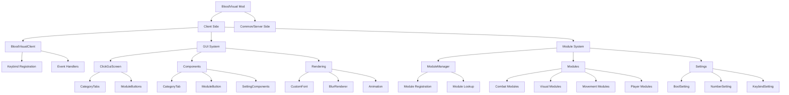
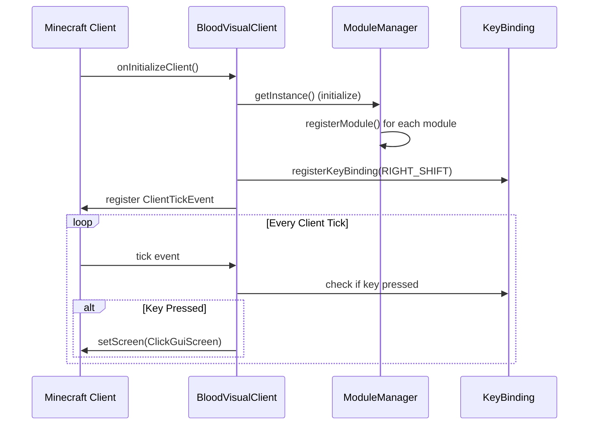
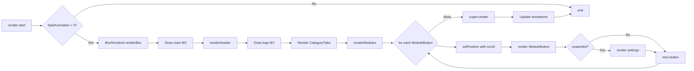
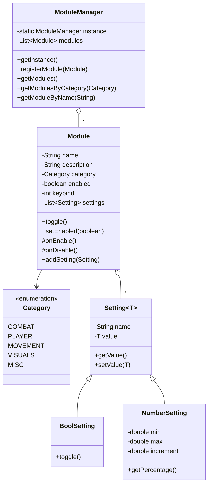
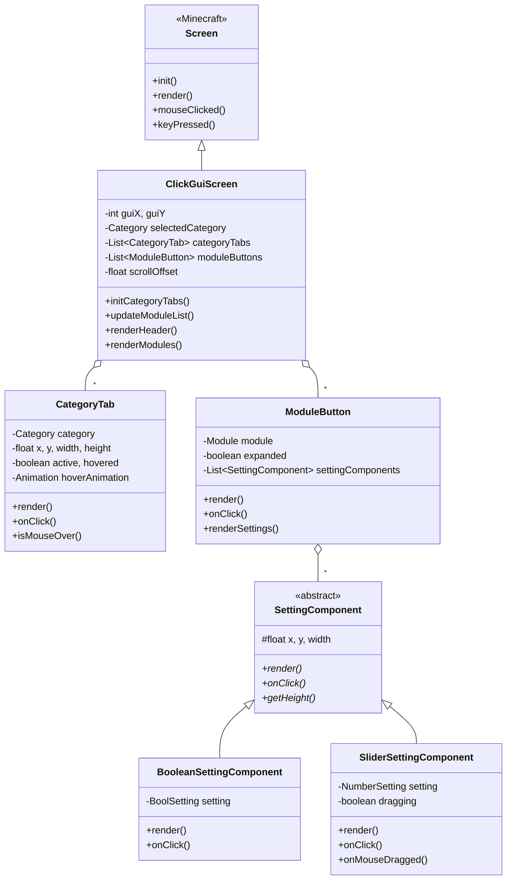
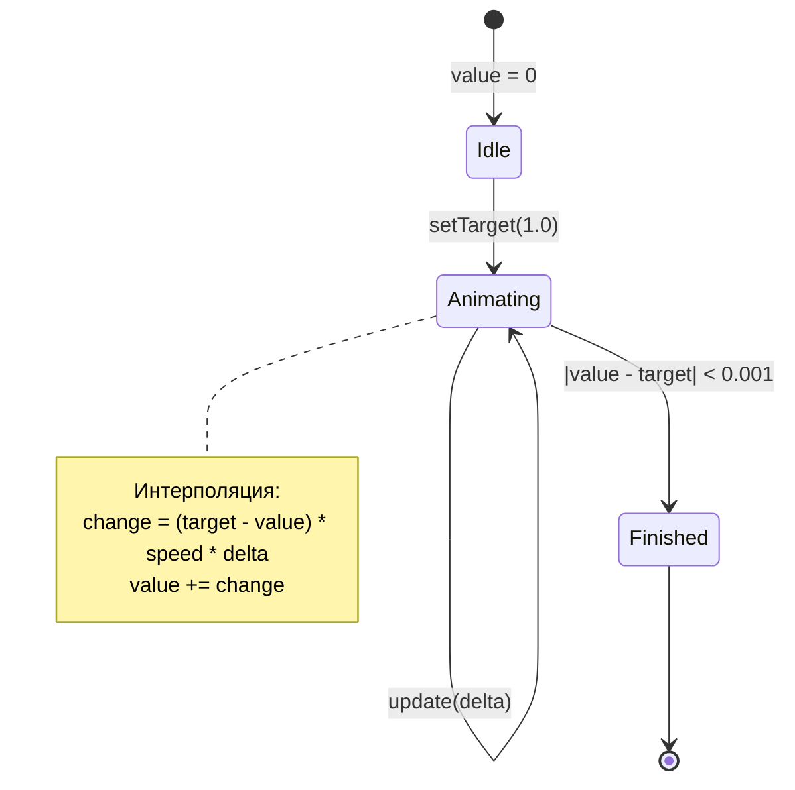
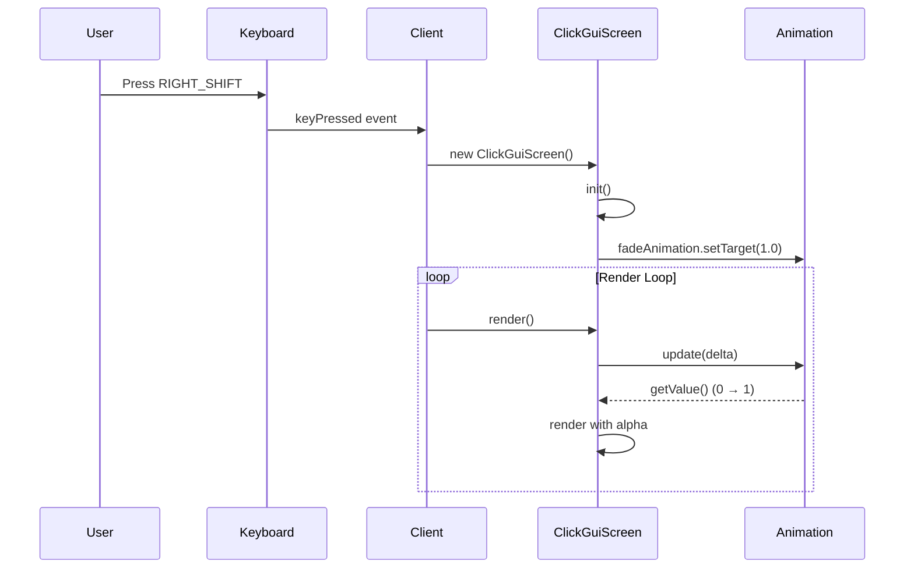
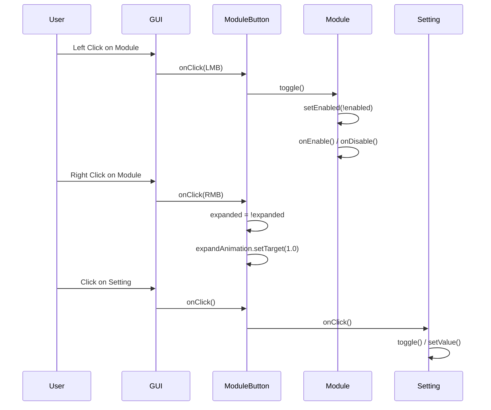
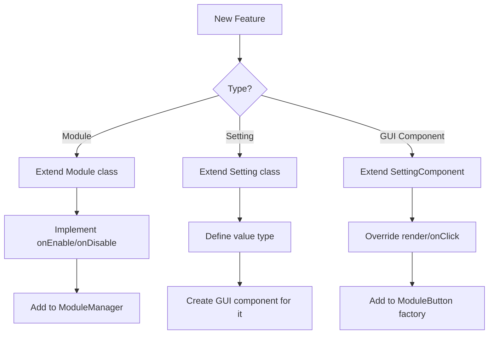

# BloodVisual - Архитектура

## 📐 Общая структура



## 🏗️ Подробная архитектура компонентов

### 1. Client Initialization Flow



### 2. GUI Rendering Pipeline



### 3. Module System Architecture



### 4. GUI Component Hierarchy



## 🎨 Rendering Layer

### Color System

```
Цветовая палитра (ARGB):
├── Фоны
│   ├── 0xF00D0D0D - Основной GUI фон (94% непрозрачность)
│   ├── 0xF0111111 - Хедер и модули
│   ├── 0xF01E1E1E - Hover эффект
│   └── 0xF01A2A1A - Активный модуль (зелёный)
│
├── Текст
│   ├── 0xFFE0E0E0 - Обычный текст (светло-серый)
│   └── 0xFFFFFFFF - Активный текст (белый)
│
├── UI элементы
│   ├── 0xFF333333 - Разделители
│   ├── 0xFF888888 - Неактивный статус
│   ├── 0xFFFFFFFF - Активный статус
│   └── 0xFFAAAAAA - Слайдер
│
└── Эффекты
    ├── 0x99000000 - Размытие (60% прозрачность)
    └── 0x44000000 - Градиент начало
```

### Animation System



## 🔄 User Interaction Flow

### Opening GUI



### Module Interaction



## 📊 Data Flow

### Module State Management

```
User Input → GUI Event → ModuleButton → Module.toggle()
                                          ↓
                                   enabled = !enabled
                                          ↓
                              ┌───────────┴───────────┐
                              ↓                       ↓
                          onEnable()              onDisable()
                              ↓                       ↓
                      Apply effects          Remove effects
```

### Setting Synchronization

```
User adjusts slider → SliderSettingComponent.onMouseDragged()
                                   ↓
                      updateValue(mouseX) → percentage
                                   ↓
                      NumberSetting.setValue(value)
                                   ↓
                            Module reads value
                                   ↓
                          Apply setting effect
```

## 🧩 Extension Points

### Добавление новых компонентов



## 🎯 Performance Considerations

### Optimization Points

1. **Rendering**:
   - Render только видимые компоненты (с учётом scroll)
   - Batch render calls где возможно
   - Использовать scissor для clipping

2. **Animations**:
   - Delta-based timing для smooth framerate independence
   - Early exit если анимация завершена
   - Lazy update (только при открытом GUI)

3. **Module Updates**:
   - Только enabled модули update'ятся
   - Event-driven вместо polling где возможно

## 🔐 Code Organization Principles

### SOLID Principles Applied

- **Single Responsibility**: Каждый компонент отвечает за одну задачу
- **Open/Closed**: Легко расширяется через наследование
- **Liskov Substitution**: Setting<T> работает с любым типом
- **Interface Segregation**: Компоненты имеют минимальные интерфейсы
- **Dependency Inversion**: Зависимость от абстракций (Module, Setting)

### Design Patterns

- **Singleton**: ModuleManager, BlurRenderer, CustomFont
- **Factory**: Creation of SettingComponents в ModuleButton
- **Observer**: Event handlers для клавиш
- **Strategy**: Разные типы Setting с общим интерфейсом

---

**Документ обновлён**: 2026-03-18  
**Версия архитектуры**: 1.0.0
